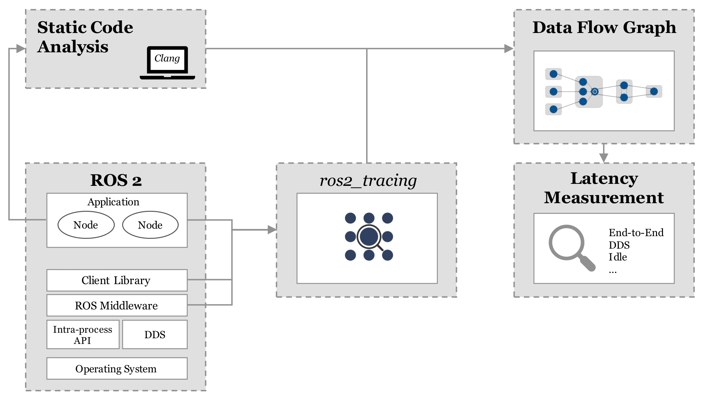
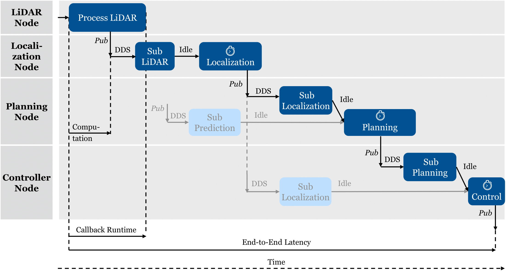

# ROS 2 Latency Analysis
This repository contains the source code used in the paper ["Latency Measurement for Autonomous Driving Software Using Data Flow Extraction"](https://ieeexplore.ieee.org/document/10186686).
It constructs a data flow graph (DFG) for a ROS2 autonomous driving software using a static code analysis. Therefore, intra-node data dependencies of C++ based ROS2 system can be found without manual annotation. 


The DFG is annotated with tracing data from [ros2_tracing](https://github.com/ros2/ros2_tracing) where we can extract different latency variables:


- We define the **_end-to-end latency_** as the time between receiving the input data from the first node and sending the output values in the last node of the considered compute graph.
- The **_communication latency_** is the time needed to send messages between the ROS2 nodes. It is the time between publishing and receiving via a subscription.
- The **_compute latency_** defines the time between the subscription of a topic, and the point where it publishes the processed data to the following node. 
- The **_idle latency_** defines the time taken for intra-node communication i.e., between subscription and timer callback.

The framework is applied in ["How Fast is My Software? Latency Evaluation for a ROS2 Autonomous Driving Software"](https://ieeexplore.ieee.org/document/10186585), where we analyzed the Autoware software stack. The entire simulation setup can be found in this repository. 

## Setup

This repository contains tools to
1. execute ROS 2 programs repeatably with tracing and resource usage tracking
2. extract ROS 2 node-internal data dependencies from C++ source code
3. analyze end-to-end latencies and their breakdowns, given data from 1. and 2.

The tools are found in the branches of this repository.
### Runner Framework

For data acquisition / simulation runs, up to three hosts can be utilized.
For all those hosts, the setup is as follows:

```bash
    git clone -b runner-framework https://github.com/TUM-AVS/ros2_latency_analysis.git runner_framework
    cd runner_framework
    ./setup.bash
```

### Code Analysis

C++ dependency analysis has to be done on the same code base that is run in the data acquisition step
but the machine can differ.
The setup is as follows:

```bash
    git clone -b code-analysis https://github.com/TUM-AVS/ros2_latency_analysis.git code_analysis
    cd code_analysis
```

Follow the instructions in the `README.md` file in that directory.

### Dataflow Analysis

Dataflow analysis has to be done with the same ROS 2 version as the above steps but the machine can differ.
The setup is as follows:

```bash
    git clone -b dataflow-analysis https://github.com/TUM-AVS/ros2_latency_analysis.git dataflow_analysis
    cd dataflow_analysis
```

Follow the instructions in the `README.md` file in that directory.

### Paper Reference
If you find the information in this repository useful we would be happy if you cite it based on the following definition:

T. Betz, M. Schmeller, H. Teper, and J. Betz, “How Fast is My Software? Latency Evaluation for a ROS 2 Autonomous Driving Software,” 2023 IEEE Intelligent Vehicles Symposium (IV). IEEE, Jun. 04, 2023. doi: 10.1109/iv55152.2023.10186585.
```
@inproceedings{Betz2023,
  doi = {10.1109/iv55152.2023.10186585},
  url = {https://doi.org/10.1109/iv55152.2023.10186585},
  year = {2023},
  month = jun,
  publisher = {{IEEE}},
  author = {Tobias Betz and Maximilian Schmeller and Harun Teper and Johannes Betz},
  title = {How Fast is My Software? Latency Evaluation for a {ROS} 2 Autonomous Driving Software},
  booktitle = {2023 {IEEE} Intelligent Vehicles Symposium ({IV})}
}
```

T. Betz, M. Schmeller, A. Korb, and J. Betz, “Latency Measurement for Autonomous Driving Software Using Data Flow Extraction,” 2023 IEEE Intelligent Vehicles Symposium (IV). IEEE, Jun. 04, 2023. doi: 10.1109/iv55152.2023.10186686.

```
@inproceedings{Betz2023,
  doi = {10.1109/iv55152.2023.10186686},
  url = {https://doi.org/10.1109/iv55152.2023.10186686},
  year = {2023},
  month = jun,
  publisher = {{IEEE}},
  author = {Tobias Betz and Maximilian Schmeller and Andreas Korb and Johannes Betz},
  title = {Latency Measurement for Autonomous Driving Software Using Data Flow Extraction},
  booktitle = {2023 {IEEE} Intelligent Vehicles Symposium ({IV})}
}
```
